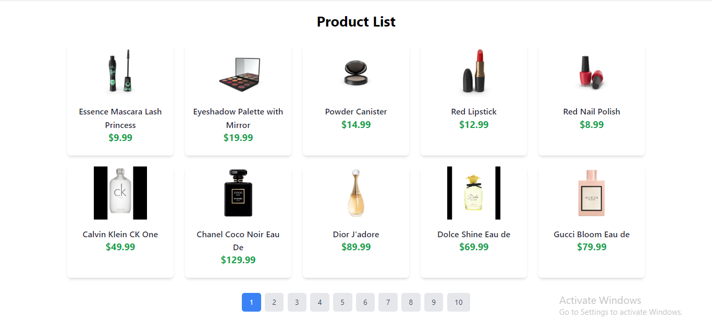
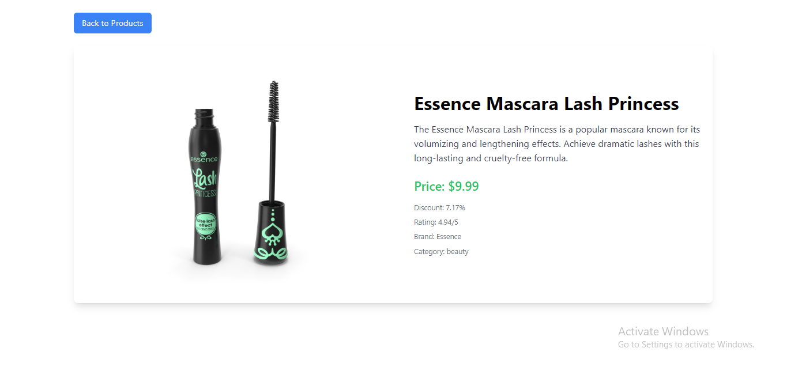

Here's a detailed and clean `README.md` template with instructions on how to add two screenshots of the product listing page and the product details page, along with descriptions:

---

# Ecommerce App

A simple two-page e-commerce application built with **React**, designed to display product data from the **DummyJSON API**. This project implements product pagination, a clean UI, and efficient state management using **Redux**.

## Features
- **Product Listing Page**: Displays a paginated list of products with title, price, and image.
- **Product Details Page**: View detailed information about a product, including description, price, discount percentage, rating, and more.
- **Responsive Design**: Clean and responsive user interface using **Tailwind CSS**.
- **State Management**: Redux for managing the application state.

## Screenshots

### 1. Product Listing Page
A paginated list of products, each displaying its image, title, and price. Users can browse products by navigating through pages.


### 2. Product Details Page
Clicking on a product from the list brings the user to the product details page, which includes the full image, description, price, rating, and other information.


## Getting Started

To get a local copy of the project up and running, follow these simple steps:

### Prerequisites

Ensure you have **Node.js** and **npm** installed on your machine.

### Installation

1. Clone the repository:
   ```bash
   git clone <repo-url>
   ```

2. Navigate to the project directory:
   ```bash
   cd ecommerce-app
   ```

3. Install the required dependencies:
   ```bash
   npm install
   ```

4. Start the development server:
   ```bash
   npm start
   ```

### Project Structure

```bash
ecommerce-app/
├── public/               # Public files
├── src/                  # React components and logic
│   ├── components/       # Reusable components
│   ├── pages/            # Pages like Product Listing and Product Details
│   ├── store/            # Redux store and reducers
├── screenshots/          # Screenshots for the README
├── package.json          # Project dependencies
└── README.md             # Project instructions and description
```

## Technologies Used
- **React**: Frontend framework for building the user interface
- **Redux**: State management library
- **Tailwind CSS**: Utility-first CSS framework for styling
- **DummyJSON API**: Mock API for fetching product data

## Usage

- **Product Pagination**: Each page displays 10 products, and users can navigate between pages using "Previous" and "Next" buttons.
- **Product Details**: Click on any product from the listing page to view more details about it, including additional images, descriptions, and ratings.

---
